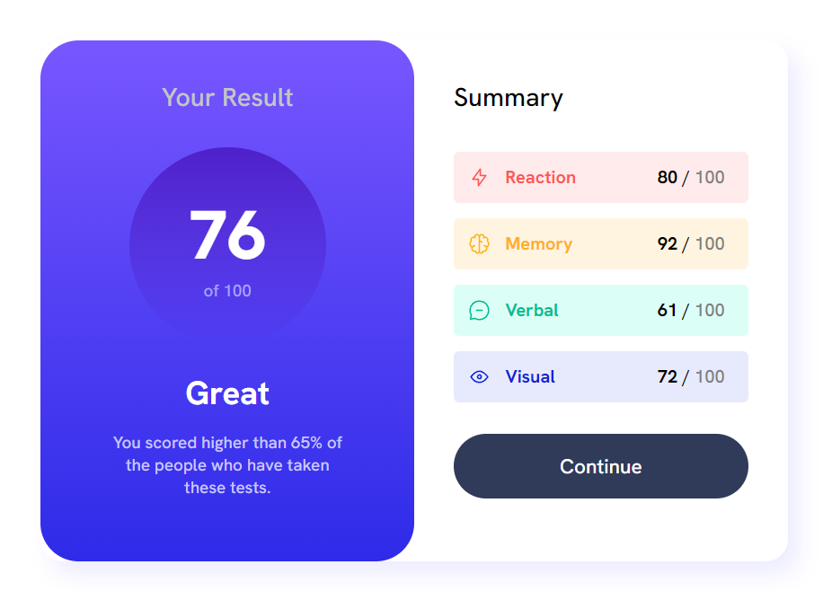

# Frontend Mentor - Results summary component solution

This is a solution to the [Results summary component challenge on Frontend Mentor](https://www.frontendmentor.io/challenges/results-summary-component-CE_K6s0maV).

## Table of contents

- [Overview](#overview)
  - [The challenge](#the-challenge)
  - [Screenshot](#screenshot)
  - [Links](#links)
- [My process](#my-process)
  - [Built with](#built-with)
  - [What I learned](#what-i-learned)
  - [Continued development](#continued-development)
  - [Useful resources](#useful-resources)
- [Author](#author)
- [Acknowledgments](#acknowledgments)

## Overview

### The challenge

Users should be able to:

- View the optimal layout for the interface depending on their device's screen size
- See hover and focus states for all interactive elements on the page

### Screenshot

**Desktop View**



**Mobile View**


### Links

- Code Solution: https://github.com/hyeo151/Frontend-mentor-projects.git
- Live Site URL: https://hyeo151.github.io/Frontend-mentor-projects/2_results-summary-component-main/

## My process

### Built with

- Semantic HTML5 markup
- CSS custom properties
- Flexbox
- Desktop-first workflow

### What I learned

1. HTML tag structures matter

I realized during my design process using css code it is very important to think about 
how I would lay out my HTML structure. This was mainly important because it indicates how I would
target the html tag using css.

2. CSS target rules

I had hard time targeting the css rule for the list of categories. I ended up targeting my css code using nth-child selector 
and adding another class to the text to adjust the color. I need to investigate what other ways to target the css code.
```css
.category:nth-child(1){
    background: hsl(0, 100%, 96%);
}
.react-text{
    color: var(--primary-light-red);
}
```

3. hsla() function was confusing

I wasn't sure how to use this function to adjust my design.
Experiment with the function necessary

4. Linear gradient

Using linear gradient was quite difficult to wrap my head around.
More practices needed.

5. Mobile design is hard. 

Mobile design was more difficult than I expected. I wasn't quite sure how to test my design and how I should design them.
More study required on this topic

### Continued development


***Things to learn.***

- hsla()
- Linear gradient
- responsive design
- CSS target
- Markdown for readme
- Flex box
- Blogging, to organize my thought process.

## Author

- Frontend Mentor - [@hyeo151](https://www.frontendmentor.io/profile/hyeo151)

