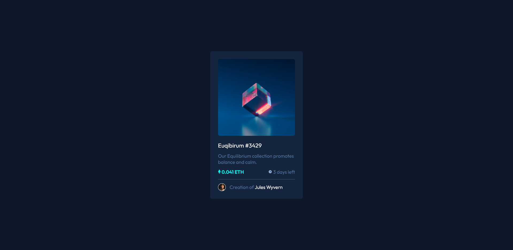
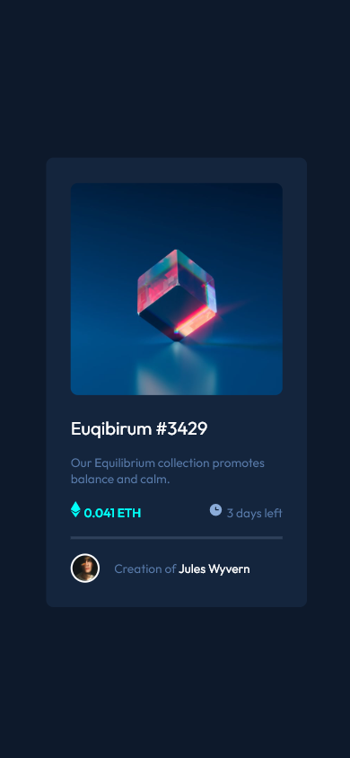

# Frontend Mentor - NFT preview card component solution

This is a solution to the [NFT preview card component challenge on Frontend Mentor](https://www.frontendmentor.io/challenges/nft-preview-card-component-SbdUL_w0U).

## Overview

### The challenge

Users should be able to:

- View the optimal layout depending on their device's screen size
- See hover states for interactive elements

### Screenshot

### Links

- Solution URL: [Solution URL](https://github.com/hyeo151/Frontend-mentor-projects.git)
- Live Site URL: [Live Site URL](https://hyeo151.github.io/Frontend-mentor-projects/5_nft-preview-card-component/)