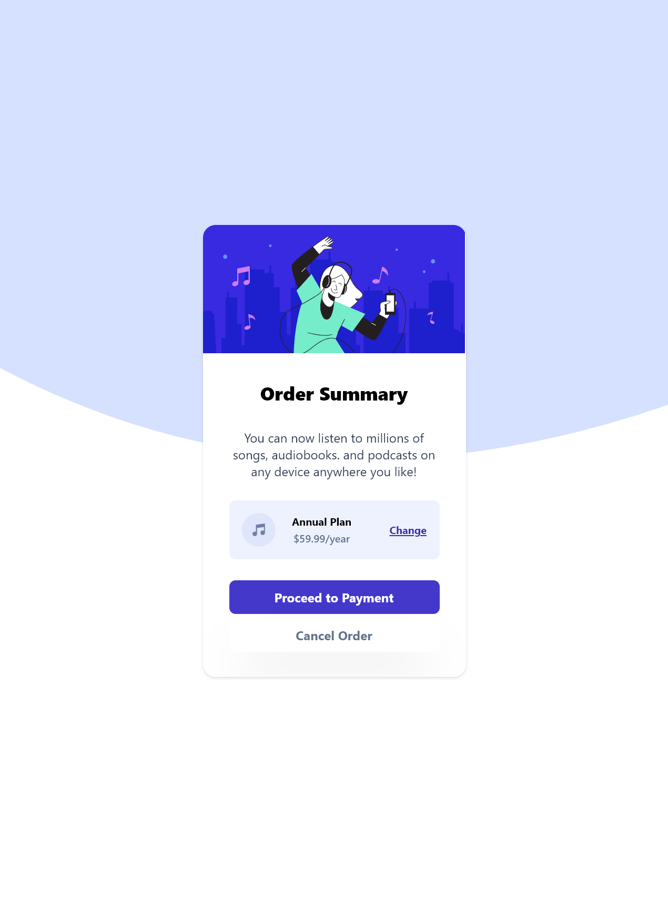

# Frontend Mentor - Order summary card solution

This is a solution to the [Order summary card challenge on Frontend Mentor](https://www.frontendmentor.io/challenges/order-summary-component-QlPmajDUj).

## Overview

### The challenge

Users should be able to:

- See hover states for interactive elements

### Screenshot

### Links

- Solution URL: [Add solution URL here](https://github.com/hyeo151/Frontend-mentor-projects.git)
- Live Site URL: [Add live site URL here](https://hyeo151.github.io/Frontend-mentor-projects/6_order-summary-component-main/)

## My process

### Built with

- Tailwind